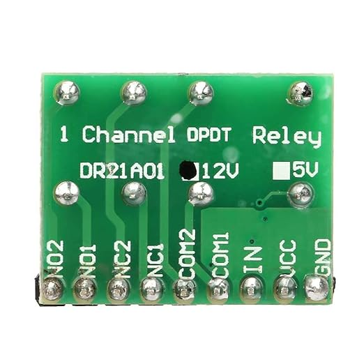

# iBoost-switch

The iboost controller has a remote sensor (CT Clamp) which wraps around one of the main wires and measures the amount of power being exported to the National Grid.  This measurement is sent via a radio signal back to the main controller.

Once the controller determines more than 100 watts are being exported the controller begins to divert this excess power to the immersion heater. The main controller balances this power as the amount of excess energy increases and decreases untill the immersion heater is running at maximum power. 

The Octopus Energy Agile Tariff is a variable pricing plan where energy is priced by the half-hour and during certain times of the day the energy price rises and falls.

Occasionally the price falls to below zero and therefore you are being paid to use energy!

The theory is that if the iBoost clamp is reversed then it will effectively be measuring the amount of power being used rather than exported and cause the controller to divert more power, and use more power untill the immersion heater is running at full power again.

This would only be required during the time when the tariff is negative so you're not only gaining additional credit but also heated water.

I have a Z-wave based home automation controller and I would like to integrate be able to control the polarity of the clamp.  When switched on the polarity is reversed and iBoost controller will be working in reverse.  When switched off the iBoost will work as it normally would and use the excess power to heat the water.

## Hardware required

- 1 x iBoost sensor
- 1 x Z-Uno microcontroller
- 1 x DPDT relay board

Clamp is connected to pins 2 & 5 and the iBoost sender is connected to pins 3 & 6.

When the relay is not energized, then current flows through 3, 2, 5 & 6.

When the relay is energized then power flows in reverse 4, 5, 2 & 1

- Pin 1 - NO 1
- Pin 2 - COM 1
- Pin 3 - NC 1
- Pin 4 - NO 2
- Pin 5 - COM 2
- Pin 6 - NC 2

